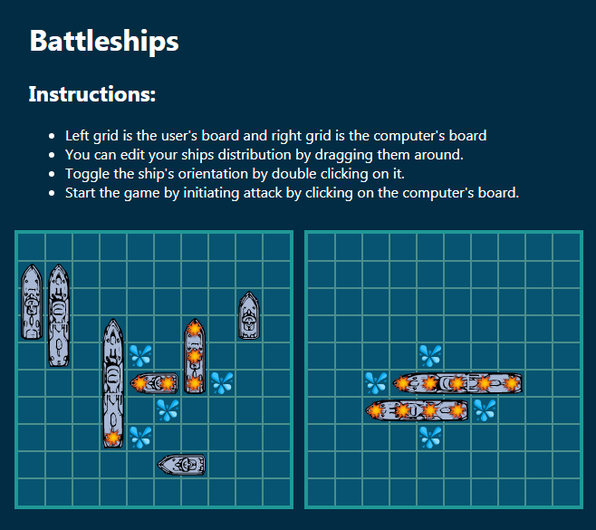

# Battle Ships

Browser based version of the board game [Battle Ships](https://en.wikipedia.org/wiki/Battleship_(game)).

## Authors

- [Oscar Nava](https://github.com/oscarnava)
- [Mauricio Robayo](https://github.com/MauricioRobayo)

## Assignment link
- [Project: Battleship](https://www.theodinproject.com/courses/javascript/lessons/battleship)

# [Live preview](https://oscarnava.github.io/battleship/)

---
## Installing
`npm install`

`npm start`

---

## Building app

`npm run build`

Application will be built in the _**dist**_ directory.

---

## Running tests

`npm test`
