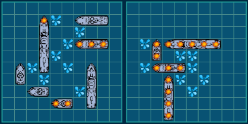
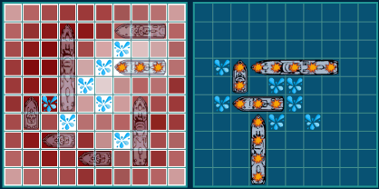

# 🚢Battle Ships Game

A browser-based version of the board game [Battle Ships](https://en.wikipedia.org/wiki/Battleship_(game)). The game starts with your ships on the board, the number depending on the selected level of difficulty. You can drag them around using the mouse, and double-click to turn it by 90°. Once you are satisfied with your distribution, start the game by initiating an attack by clicking over any empty cell on the computer board.

### Watch me think!

You can even watch in real-time the strategy that the computer is using at that moment. Dark red cells are those where the computer thinks it's more probable to find a ship, and the lighter or white ones are where she thinks it's less probable to hit a ship.

##### [👀 Click here for a live preview](https://oscarnava.me/battleships/)

---
## 🛠 Built with:
- HTML
- SASS *(I like indentation based languages)*
- Javascript
- ☕ Lots of coffee...

---
## 👤 Contributors

- [Oscar Nava](https://github.com/oscarnava) 📧 contact@oscarnava.me
- [Mauricio Robayo](https://github.com/MauricioRobayo) 📧 hi@mauriciorobayo.com

## 🔗 Assignment link

- [Project: Battleship](https://www.theodinproject.com/courses/javascript/lessons/battleship)

---

## 🔧 Installing

After cloning the repository to your local development machine, type this on the command line:

`npm install`

`npm start`

---

## 🔨 Building the App
Enter on the command line:

`npm run build`

Application will be built in the _**dist**_ directory.

---

## 🧪Running tests
Enter on the command line:

`npm test`

## ⌛ Todo's

- [ ] Improve use in small screen devices
- [ ] ~~Create different levels of difficulty~~

## 📦 Contributing
Contributions, issues and feature requests are welcome!

Feel free to check the [issues page](https://github.com/oscarnava/Battleship/issues).

## 🗝 License
Creative Commons [Attribution 4.0 International (CC BY 4.0)](https://creativecommons.org/licenses/by/4.0/).

## 📡 Contact

Please don't hesitate to contact me at 📧 [contact@oscarnava.me](contact@oscarnava.me) if you have any questions, comments, etc. I would love to know what's on your mind!
